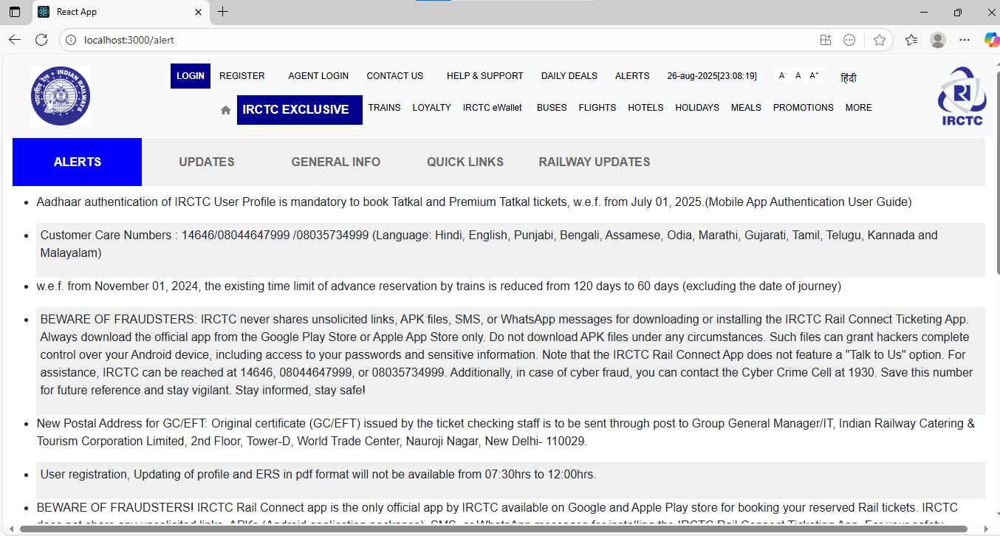

# IRCTC App Clone  

A full-stack IRCTC Ticket Booking Clone built with React.js (frontend) and Node.js + Express (backend), integrated with MongoDB for database.  
It includes features like user authentication, train search, ticket booking with a responsive modern UI.  

## Tech Stack & Dependencies  

- Frontend: React 19, React Router DOM, Bootstrap 5, FontAwesome, React Icons, React Datepicker, Google reCAPTCHA  
- Backend: Node.js, Express, MongoDB (Mongoose), JWT, Bcrypt 
- Utilities: Axios, Date-Fns, Dotenv, CORS  
- Testing: React Testing Library, Jest DOM, User Event  

---

## Features  

-  Secure User Authentication (JWT + bcrypt)  
-  Ticket Booking System with train & date search  
-  Interactive Date Picker  
-  Google reCAPTCHA for bot protection   
-  Mobile-friendly Responsive UI (Bootstrap + Icons)  
-  MongoDB Integration for users & bookings  

##  Installation  

### Prerequisites  
- Node.js (>=18.x)  
- npm (>=9.x) or Yarn  
- MongoDB (local or Atlas)  
- To load the trains data in your MongoDB as per this train schema

### Steps  
# Clone repository
git clone https://github.com/Indu-Kella/IRCTC-CLONE.git
cd irctc-clone

# Install frontend dependencies
npm install

# Install backend dependencies
cd backend
npm install
````

### Setup Environment Variables

Create a `.env` file inside `backend/`:

```env
PORT=5000
MONGO_URI=your_mongo_connection_string
JWT_SECRET=your_secret_key

### Run the App

# Start backend
cd backend
node server.js

# Start frontend
cd irctc-clone
npm start

 Open [http://localhost:3000](http://localhost:3000)

---

## Testing

npm test

---

## License

This project is for educational purposes only and not affiliated with official IRCTC.

# Output:

### Home 


### Login 


### Register


### Contact 


### Help & Support
 

### Alerts


### TrainsList


### PassengerDetails 

